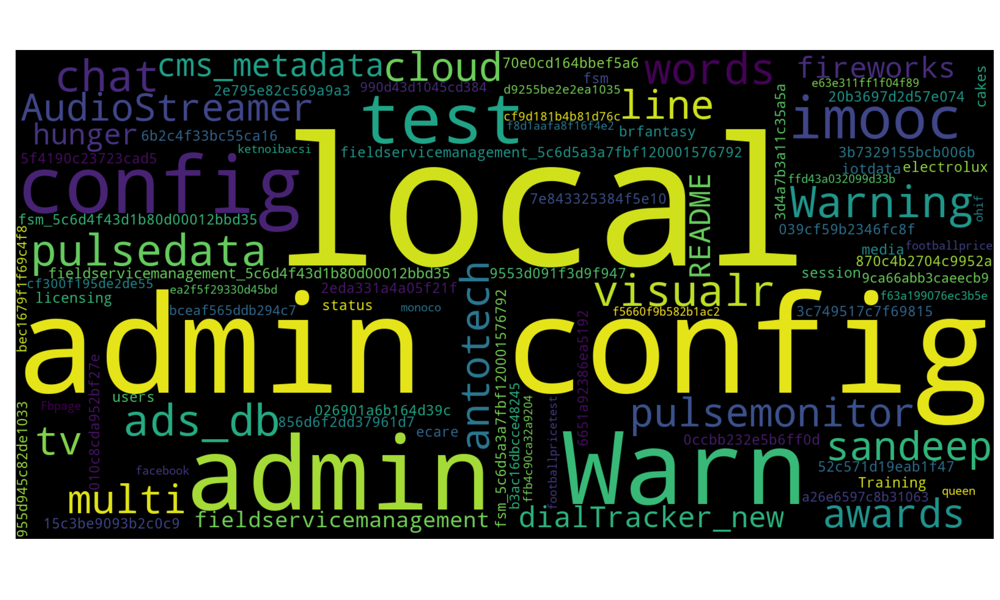
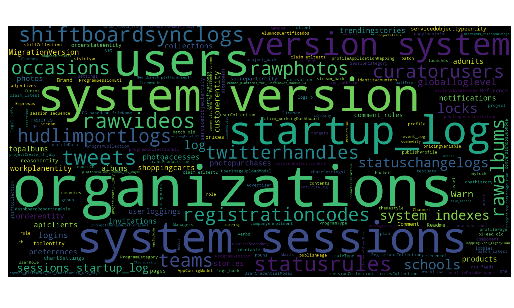

# Shodan MongoDB Search and Visualize

**shodan-mongodb** is a tool to search unauthenticated MongoDB instances on Shodan.io and it visualizes the data it gathers.
The sole purpose of the code is to educate myself on python. 

I'm not a programmer, so please don't humiliate me with the code style & quality and use it at your own risk.

**Sample Output**

Databases:

Collections:

